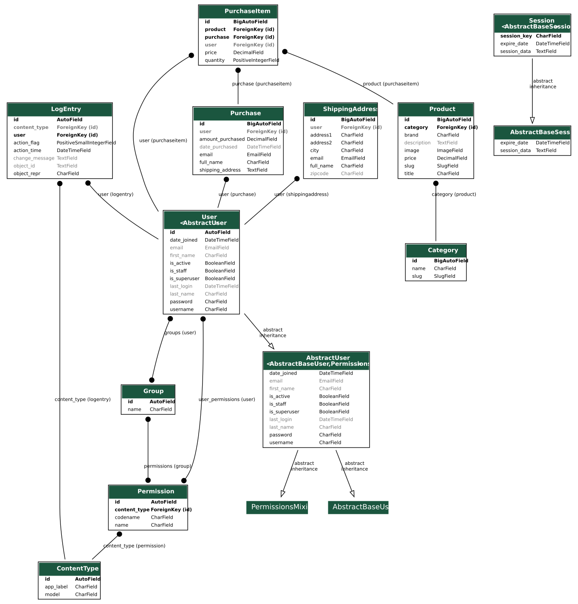
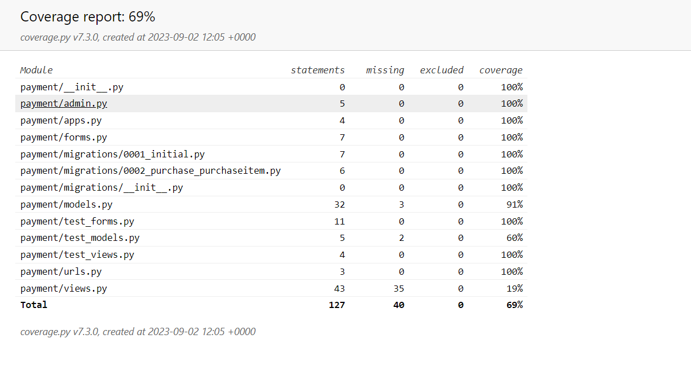

# Project 5
- Welcome to my Project 5 Eccomerce store where I created a Pokemon Shop since I am a passionate fan of Pokemon and wanted to try and create my very own store where other pokemon fans can access and enjoy looking at only pokemon items that they can purchase and look at the great design. In this project I demostrate a payment system Paypal and use CRUD functionallity for users to be able to update and delete items and also create profile, update profile and delete profile! :)
- Here are the links to the deployed version of my website and my Github Repository!
- https://pokemon-shop-ecommerce-ee0b37d9ff00.herokuapp.com/ - Heroku App
- https://github.com/aokealy/pokemonshop - Github Repository
# UX Design
## Mockup:


## Wireframes:
- This is a wirframe of the login and Register where I wanted a box shape in the centre to dominate so user fixates on that.
<hr>


- This is the main page where you will find all the products on the page. I want to show what items are available and also entice people to create a profile.
<hr>

- Product information gives you a description with the price and a quantity selector. 
<hr>

- Final Checkout where you fill out your details and have access to payment buttons with simple layout.
<hr>

- Pokemon Hub where logged in Users will have access and easy to access with easy layout.
<hr>

- Shipping Form similar to final checkout form where the layout is easy and tells you what to fill in.
<hr>

- Profile Management where it is easy to update and Profile and also delete profile with big buttons and in center for user to easily read and understand.
<hr>

- ERD Diagram
<hr>


## Typhography:

## Colour Scheme
- Used a boostrap theme called Journal which gives off a nice red tone.
- The colours that were used during this project were based off Pokemon colours from different ones such as pikachu, charizard, squirtle etc..

## Agile User Stories:
- Here is a link to my user stories: 
- I followed this guidline and mapped three cards using Kanban board to determine what was next such as todo, progress and done for completion of my user stories and made sure to follow through and complete each task as I went along during this project. 
- https://github.com/users/aokealy/projects/6/views/1


## User Stories Documentation:
### User Stories - Registration

- User to be able to register account
- User to fill out required fields to register
- User to be redirected to Register success page
- User to login after Register Login Page
- User to be able to access features when creating account
- User can still shop even not registered

### User Stories - Login
- User to be able to login
- User to login after registration
- User to be able to login with username and password
- User to be able to go to register page from login page
- User will get message saying user has logged in successfully
- User to be able to have access to features only for login users

### User Stories - Filter Products
- User to be able to select different Categories
- User to filter the products into categories

### User Stories - Profile
- User who is logged in has access to Pokemon Hub Page
- User can view Profile Management Page
- User can update username and email
- User can view Order history of purchases they have made
- User can update shipping information
- User can have pre-filled shipping information when checkout
- User can delete profile
- User can logout of Profile

### User Stories - Payment
- User to be able to make payment after checkout
- User has to have filled in shipping form before user can make payment
- User has to fill out all required fields to click payment buttons
- User after payment will be redirected to either success page or failed page
- User checkout will clear after payment is made
- User will be able to Track Purchase history after a payment is made

### User Stories - Checkout
- User to be able to add items to checkout
- User to be able to update items in checkout
- User to be able to update quantity in checkout
- User to be able to delete items in checkout
- User to continue shopping with items in checkout bag
- User to be able to logout and still have item in checkout

### User Stories - Products
- User to be able to see price and image of product on shop page
- User to be able to click on product title
- User to view Product information page
- User to be able to see image of Product information page
- User to be able to see description and price of product
- User to be able to able to update quantity of product
- User to add product to checkout with button
- User can scale page to mobile view and still see everything clearly

### User Stories - Logout
- User to be able to logout from any page since it will have logout button
- Logged in Users will only see logout button
- User message will appear after user logs out
- User will no longer see features for logged in users after logging out

# Features:
- Be able to register for a profile without accessing the admin page.
<hr>

- Be able to login after the user has created a profile and can login by entering the username and password that they provided and not need to use the admin page to login.
<hr>

- Be able to browse Shop and filter the products based on the two categories as to what they are looking for and display all products on the main shop page too.
<hr>

- Be able to click on a product title and bring that user to a new page where you will see new information on that product such as the description and the set it comes from. Also be able to update the quantity of the product to when adding to checkout.
<hr>

- Be able to view Pokemon Hub for only logged in users where they get special access to features that only registered users can see. 
<hr>

- Be able to view recent purchases history for logged in users and see what they have purchased, the price and the quantity.
<hr>

- Be able to manage profile details such as username and email for logged in users which is only exclusive to logged in users which is my CRUD functionallity where the user can create a profile, update their profile and delete their profile.
<hr>

- Be able to delete your profile for logged in users so when deleting your profile everything linked such as recent purchases and name and email will be deleted.
<hr>

- Be able to edit and make changes to shipping form for logged in users and have prefilled information so when paying at checkout that your shipping info is there and is only exclusive for logged in users.
<hr>
- Be able to checkout page for either logged in or non logged in users and being able to update or delete items in checkout

- Be able to fill in shipping information unless pre-filled for logged in users and be able to pay through paypal
<hr>


## Feed Back system 
- I used Django messages to return a feedback system where users can 
- When a user logs in a message will appear

- When a user logs out a message will appear


## Future Features:
- Create emails registration where user can verify accounts
- Users to leave reviews on products
- User to give feedback system such as ratings
- User to contact sellers
- User to pay than one payment system

# Testing:

## Automated Testing: 
- I used Django Unnitest for automated testing where we test using testcase and we create a coverage report that show all test within an app.
- The first app I tested Payments Forms, views, models and urls.

- Second app I tested was Profiles


## Manual Testing:
- For Manual Testing I tested everything referencing the User Stories I created in the Project section of my Github Repository to follow through and test manually each function.
## Test Registration System: 
- Test that user can register an account - Expected Result - When form is submitted the user will be redirected (working) 
- User to fill out required fields to register - Expected Result - User will not be able to submit form without required fields filled (working)
- User to be redirected to Register success page - Expected Result - User after submitting form to be redirected to success page to indicate the user has succeeded in registering (working)
- User to login after Register Login Page - Expected Result - after user registering the user can then proceed to login (working)
- User to be able to access features when creating account - Expected Result - User after logging in will see features that are only accesseable to logged in users (working)
- User can stil shop even not registered - Expected Result - non logged in users can still view products and add to checkout (working)

## Test Login (working)
- User to be able to login (working)
- User to login after registration (working)
- User to be able to login with username and password (working)
- User to be able to go to register page from login page (working)
- User will get message saying user has logged in successfully (working)
- User to be able to have access to features only for login users (working)
## Test Logout (working)
- User to be able to logout from any page since it will have logout button (working)
- Logged in Users will only see logout button (working)
- User message will appear after user logs out (working)
- User will no longer see features for logged in users after logging out (working)

## Test Filter Products (working)
- User to be able to select different Categories (working)
- User to filter the products into categories (working)
- Test clicking on Product (working)
- Test Add Product to checkout (working)
- Test Update Product in checkout (working)
- Test Delete Product in checkout (working)
- Test checkout sessions (working)
- Test Profile Management update username and email(working)
- Test Delete Profile(working)
- Test Shipping Address form (working)
- Test Paypal payment (working)
- Test redirected to success and checkout cleared(working)
- Test Track purchases (working)
- Test authenticated Users only access to pokemon hub page (working)

## Manual JavaScript Testing:
Before implementing the Ajax checkout process I tested my code using shell where I could render that the session was working and returning the session id so it would display in the terminal what was currently in the checkout whiched worked well.
<hr>

Javascript JSHint to test Javascript code.
<hr>


## Additional Testing:
- Lighthouse Report


- CSS Validator 


- Responsiveness Test:
- Tested the responsive test which bootstrap helps with their templates to fit pages on any page and any screen where I manually tested using google chrome developement tools to test the responsiveness of my project.


BUGS:
========
- There were not too many bugs that I encountered but most bugs were typo errors.
- Bug where the checkout was constantly failing payment (fixed)
- Bug where templates were not loading and django not recognising them (fixed)
- Known bug - When you change the scaling view on a forms page where it is too small it would not be as responsive (kinda fixed)


Facebook Page:
========


Ecommerce Business Model:
========
- E-commerce marketing strategies involve promotional tactics to drive traffic to an online store. A well-thought-out marketing plan, coupled with an engaging website, can convert visitors into paying customers, help businesses retain them and increase their overall customer lifetime value (CLV). If marketing teams stay up to date on the latest trends, they can help the organization reach and retain new customers.

These 10 e-commerce marketing strategies can help set an organization apart from its competition, strengthen the brand, attract new customers and increase sales over time.

1. Search engine optimization
Launching a website is a win for any e-commerce company, but websites aren't enough for consumers to easily find the brand. To improve visibility, marketing teams must optimize websites for search engines. Positive search engine optimization (SEO) requires marketing teams to continually update websites with rich and relevant content that provides useful information for customers.

An SEO strategy can help organizations ensure their content shows up on search engine results pages (SERPs) for relevant queries and deliver positive CX when customers find the information they need. Marketing teams should use SEO keywords and phrases organically within content to alert search engines to the site's relevance for those queries.

Marketing teams should also use easy-to-read URLs and descriptive page names that contain a primary keyword. These URLs and names can also include familiar words or phrases that customers likely use as they search. This strategy requires keyword research to identify opportunities for new content.

2. Content marketing
To support SEO and build brand authority, marketing teams should embrace content marketing in their e-commerce marketing strategies.

For example, a blog can help build a successful marketing strategy and enable brands to produce relevant content about their products. Blogs let marketing teams target important keywords that might not fit naturally on product or category pages. This content can speak directly to consumer needs, offer helpful solutions, build trust and strengthen relationships. Overall, blogs can lead to increased brand visibility and higher conversion rates from new and existing customers.

Content marketing helps answer customers' questions, educate them, deliver the company narrative and lead people to make a purchase. Additionally, different content types, like video, downloadable guides and user-generated content, can strengthen a brand's reputation. This content can also feed the blog and bring more eyes to the organization and its offerings.

3. Social media marketing
In addition to strong SEO that helps content show up on SERPs, brands should meet consumers where they are: on social media. These channels can help engage an active audience.

Billions of people use social media each month, and social media can help brands create authentic connections with their followers. On social media platforms, marketing teams can also respond to comments, publish relevant content and provide more information about their company's products.

Marketing teams should select the right platforms to manage and distribute this content. For example, people on Twitter want to see different content than people on Instagram. Marketing teams should know which platforms the customer base is most likely to use and align the channel they use with them.


TECHNOLOGIES:
=============
The following languages, frameworks, libraries, and tools were used to construct this project. 
* HTML
* CSS
* Javascript/ajax
* Bootstrap (https://getbootstrap.com/) : This project uses Bootstrap to simplify the development of the webpage
* Python 
* Django
* Sqlite3
* Heroku
* PayPal 
* Postgres 

Frameworks:
=============
Bootstrap
==========

This is a front-end framework which is built using HTML and CSS. It makes it easy to create responsive websites using a grid system with screen-width breakpoints.
The homepage 'Most Popular' and 'New Products' functionality is partially provided by the Bootstrap Carousel feature.
Badges are used to provide the item count above the basket; they are also used to detail the status of each individual item status on the Order History page.

JQuery
==========

This is a JavaScript framework which enables easy manipulation of the Document Object Model (DOM) using JQuery syntax.
This was used to provide the interactive functionality for the homepage carousels. I customised some JavaScript code I found on the internet (see credits) in order to have multiple carousels on one page.

Font Awesome
==========

This is a font library which I have used to provide some context appropriate icons throughout the application. For example, the Basket icon.

Django
==========

This is a high-level python framework which provides advanced functionality with minimal effort from the developer.
The application is developed using Django and extensively uses built-in functionality and custom packages.


# References:
- https://getbootstrap.com/docs/4.6/getting-started/introduction/ - bootstrap
- https://bootswatch.com/journal/ - bootsrtrap theme
- https://fontawesome.com/ - fontawesome icons
- https://www.color-name.com/pikachu-yellow.color - Pikachu bolt colour
- https://www.schemecolor.com/squirtle-pokemon-colors.php - Crystal Squritle Register Icon colour
- https://www.color-hex.com/color-palette/24560 - Bulbasaur green login colour
- https://www.color-hex.com/color-palette/24565 - Charizard orange shop cart
- https://getbootstrap.com/docs/4.0/components/card/ - bootstrap cards
- https://www.color-hex.com/color-palette/105957 - caterpile colours
- https://pypi.org/project/django-mathfilters/ - django mathfilters
- https://developer.paypal.com/home - Paypal Sandbox
- https://developer.paypal.com/integration-builder/ - integrate PayPal
- https://developer.paypal.com/docs/regional/th/checkout/integration-features/customize-button/ - PayPal buttons
- https://developer.paypal.com/docs/checkout/standard/customize/validate-user-input/ - PayPal validate User Input
- https://www.youtube.com/watch?v=3YKXhdOGR-s&t=1285s&ab_channel=SharmaCoder - for ajax inspiration 
- <https://www.pngitem.com/middle/hmmTooo_m-latias-ex-pokemon-card-hd-png-download/> Heatron ungraded
- <https://www.pngitem.com/middle/ihTmwRw_image-pokemon-tcg-hidden-fates-hd-png-download/> Motres, Zapdos and Articuno ungraded
- <https://www.pngitem.com/middle/wwoRho_mega-lucario-pokemon-cards-ex-and-gx-hd/> Lucaio Ex ungraded
- <https://d16hw7tbcsk68f.cloudfront.net/s3/cgccards-production/research/subcategories/pok_neo-v2.png> Japanese Lugia graded
- <https://www.cgccards.uk/Resources/images/grading/trading-cards/why-cgc-trading-cards-pokemon-crop.png?cb=2021-07-30> Trophy Pikachu graded
- <https://d16hw7tbcsk68f.cloudfront.net/s3/cgccards-production/research/subcategories/pok_original-series.png> Charizard graded
- <https://www.pngitem.com/middle/iRhoToh_pokemon-ex-cards-png-transparent-png/> Deoxys Image
- <https://d16hw7tbcsk68f.cloudfront.net/s3/cgccards-production/research/subcategories/pok_pop-series.png> Espeon Gold Star Graded
- <https://d16hw7tbcsk68f.cloudfront.net/s3/cgccards-production/research/subcategories/pok_e-series-v2.png> Celebi Graded
- <https://www.pngitem.com/middle/owRRwJ_pokemon-cards-png-pokemon-alakazam-ex-transparent-png/> Alakazam ungraded
- https://jshint.com/ - Javascript testing
- https://jigsaw.w3.org/css-validator/ - CSS Validator 
- https://validator.w3.org/ - html validator

## Deployment

This application uses the following platforms for deployment:

- [Heroku](https://dashboard.heroku.com/) - primary hosting platform.
- [ElephantSQL](https://www.elephantsql.com/) - managed Postgres database service.
- [Amazon S3](https://aws.amazon.com/s3/) - static and media files hosting.

To follow along to this deployment guide, you will need accounts on the above
platforms, some of which may require a payment card. It is recommended to use
appropriate naming conventions for the resources you create, it is easy to
remember which parts link together.

_This guide assumes that no secrets have been
pushed to version control._ For example, you have maintained an untracked `env.py`
file for local environment variables such as the Django `SECRET_KEY`. Switch any
values in `<angled_brackets>` with your equivalent variable.

Here is an outline of the steps taken to bring this app to the web:

1. Create an ElephantSQL instance by selecting a region and noting your database url.
2. Create a new Heroku app and add a config var for `DATABASE_URL` and assign it
   the value provided from your Postgres database on ElephantSQL, without any quotation marks.
3. Install the following dependencies in your Django project:

   ```py
   pip install dj_database_url==0.5.0 psycopg2-binary gunicorn
   ```

4. Freeze your requirements:

   ```py
   pip freeze > requirements.txt
   ```

5. Create `env.py` if not present and add it to your `.gitignore` to keep from version control.
6. Set the following:

   ```py
   os.environ['DATABASE_URL'] = '<YOUR_ELEPHANTSQL_DATABASE_URL>'
   ```

7. In `settings.py`, create a configuration like this, with:

   ```py
    import dj_database_url

     DEVELOPMENT_DB = {
       "default": {
           "ENGINE": "django.db.backends.sqlite3",
           "NAME": BASE_DIR / "db.sqlite3",
       }
   }

   PRODUCTION_DB = {"default": dj_database_url.parse(os.getenv("DATABASE_URL"))}

   DATABASES = PRODUCTION_DB
   ```

8. You can now `migrate` and `createsuperuser` for the ElephantSQL database.
   Now is a good time to check that your tables have been added on the ElephantSQL browser:

   

9. Create the `Procfile` for Heroku like so:

   ```py
   web: gunicorn <YOUR_DJANGO_STARTPROJECT_APP>.wsgi:application
   ```

10. Set the env var `DISABLE_COLLECTSTATIC=1` on Heroku.
11. Set the host name of the Heroku app into the list of `ALLOWED_HOSTS` in Django settings.
12. Link your GitHub repository to your Heroku app under Heroku's 'Deploy' tab.
    Optionally, choose to enable automatic deploys.
13. Add a Heroku env var for the Django `SECRET_KEY`
14. Ensure that `DEBUG` is configured to be `False`
15. You may choose to trigger a Heroku deployment here, however no static files will be present
16. On your AWS account, create a new S3 bucket. Select your region and uncheck
    the block on public access, confirming where necessary. Ensure that ACLs are
    enabled and select bucket owner preferred.
17. Enable static website hosting to create an endpoint. Specify your index document
    as `index.html` if asked.
18. In permissions, paste the following code block for your CORS configuration:

    ```json
    [
      {
        "AllowedHeaders": ["Authorization"],
        "AllowedMethods": ["GET"],
        "AllowedOrigins": ["*"],
        "ExposeHeaders": []
      }
    ]
    ```

19. In the S3 bucket policy generator, set `principal=*` and `actions=GetObject`
20. Copy and paste in the ARN name from properties.
21. Click to add statement then generate policy. Copy the policy into the bucket
    policy editor. Append the value the `Resource` key with `/*`
22. The bucket policy can be saved, ensuring that 'List' is checked for 'Everyone (public access)'.
23. Moving from S3 to IAM, create a group. Navigate to 'create policy' (JSON).
24. Search from and import the `AmazonS3FullAccess` policy. Copy and paste it in to the policy.
25. Set `Resource` to a list containing `<YOUR_ARN>` and `<YOUR_ARN/*>`
26. The policy can now be reviewed and created, then attached to the newly created
    group under the permissions section.
27. Create a user for the group, enabling programmatic access.
28. With the user created, go to 'Security Credentials', 'Access Keys' and click
    'Create access key'.
29. Select 'Create Access Key' and ensure you download the `.csv` file provided.
30. Back in the Django project, install the packages `boto3` and `django-storages`,
    remembering to freeze them into `requirements.txt`
31. Add `storages` to the list of installed apps.
32. The `AWS_ACCESS_KEY_ID` and `AWS_SECRET_ACCESS_KEY` config vars can be set in
    Heroku, using the credentials from the `.csv` file.
33. `DISABLE_COLLECTSTATIC` can be set `False` on Heroku.
34. On Heroku, set a config var for `USE_AWS=True` and create an `if USE_AWS:`
    branch in `settings.py`
35. Under this if branch, create a block like this:

    ```py
    AWS_S3_ACCESS_KEY_ID = os.getenv("AWS_S3_ACCESS_KEY_ID")
    AWS_S3_SECRET_ACCESS_KEY = os.getenv("AWS_S3_SECRET_ACCESS_KEY")
    AWS_S3_STORAGE_BUCKET_NAME = os.getenv("AWS_S3_STORAGE_BUCKET_NAME")
    AWS_S3_REGION_NAME = os.getenv("AWS_S3_REGION_NAME")
    AWS_S3_CUSTOM_DOMAIN = os.getenv("AWS_S3_CUSTOM_DOMAIN")

    STATICFILES_STORAGE = "<YOUR_STARTPROJECT_APP>.custom_storage.StaticStorage"

    DEFAULT_FILE_STORAGE = "<YOUR_STARTPROJECT_APP>.custom_storage.MediaStorage"

    STATIC_URL = f"{AWS_S3_CUSTOM_DOMAIN}/static/"
    MEDIA_URL = f"{AWS_S3_CUSTOM_DOMAIN}/media/"

    AWS_S3_OBJECT_PARAMETERS = {"CacheControl": "max-age=86400"}
    ```

    The storage bucket name and region comes from the bucket you set up in AWS.
    The custom domain can be constructed by removing the `http://` scheme and `website-`
    from your static website hosting endpoint.

36. The `custom_storage` module can be created in `<YOUR_STARTPROJECT_APP>`. In
    this application, the folder is entitled `pp5`. Your module should look something
    like this:

    ```py
    import os

    from storages.backends.s3boto3 import S3Boto3Storage

    class StaticStorage(S3Boto3Storage):
        bucket_name = os.getenv("AWS_S3_STORAGE_BUCKET_NAME")
        location = "static"

    class MediaStorage(S3Boto3Storage):
        bucket_name = os.getenv("AWS_S3_STORAGE_BUCKET_NAME")
        location = "media"

    ```

    Consult the [django-storages](https://django-storages.readthedocs.io/en/latest/backends/amazon-S3.html)
    documentation for more information about using this class.
