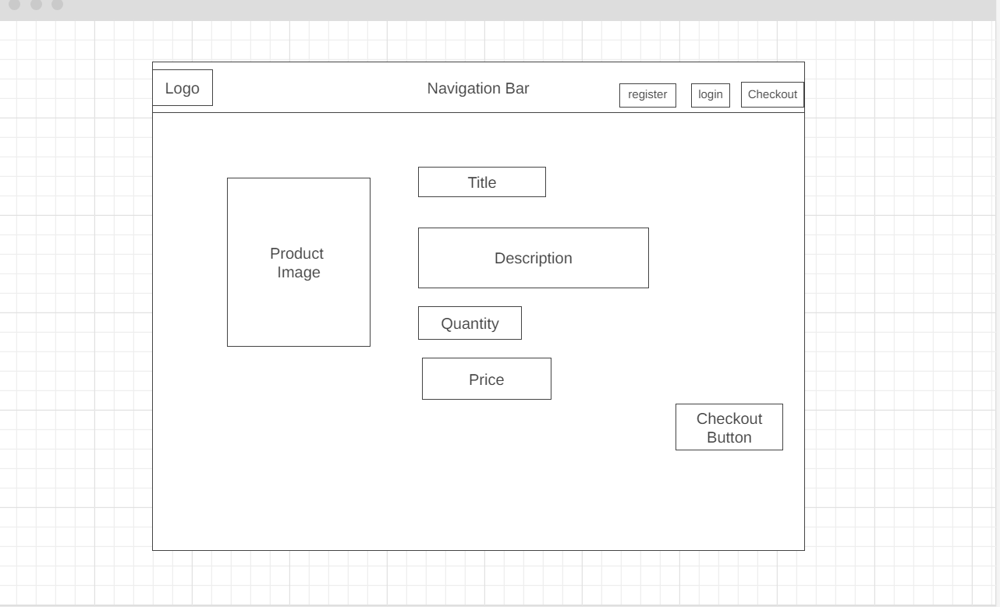
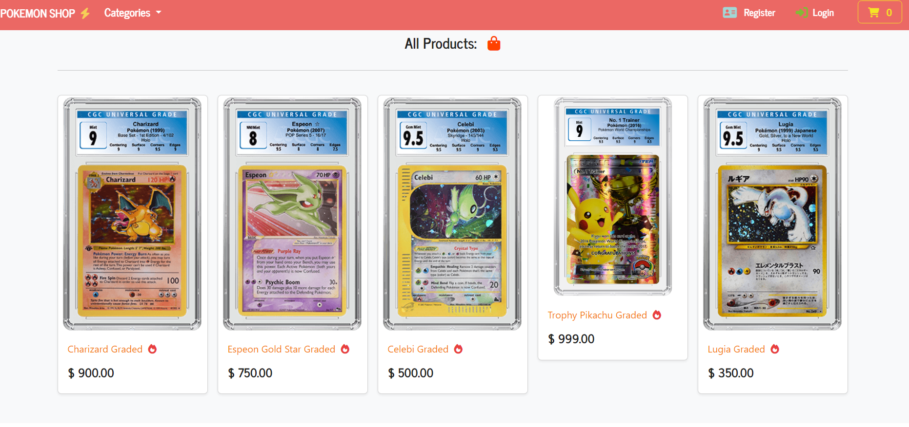

# Project 5
- Welcome to my Project 5 Eccomerce store where I created a Pokemon Shop since I am a passionate fan of Pokemon and wanted to try and create my very own store. In this project I demostrate a payment system Paypal and use CRUD functionallity for users to be able to update and delete items and also create profile, update profile and delete profile! :)
- Here are the links to the deployed version of my website and my Github Repository!
- https://pokemon-shop-ecommerce-ee0b37d9ff00.herokuapp.com/ - Heroku App
- https://github.com/aokealy/pokemonshop - Github Repository
# UX Design
## Mockup:


## Wireframes:
- This is a wirframe of the login and Register where I wanted a box shape in the centre to dominate so user fixates on that.
<hr>


- This is the main page where you will find all the products on the page. I want to show what items are available and also entice people to create a profile.
<hr>

- Product information gives you a description with the price and a quantity selector. 
<hr>

- Final Checkout where you fill out your details and have access to payment buttons with simple layout.
<hr>

- Pokemon Hub where logged in Users will have access and easy to access with easy layout.
<hr>

- Shipping Form similar to final checkout form where the layout is easy and tells you what to fill in.
<hr>

- Profile Management where it is easy to update and Profile and also delete profile with big buttons and in center for user to easily read and understand.
<hr>


## Typhography:

## Colour Scheme
- Used a boostrap theme called Journal which gives off a nice red tone.
- The colours that were used during this project were based off Pokemon colours from different ones such as pikachu, charizard, squirtle etc..

## Agile User Stories:
- Here is a link to my user stories: 
- I followed this guidline and mapped three cards using Kanban board to determine what was next such as todo, progress and done for completion of my user stories and made sure to follow through and complete each task as I went along during this project. 
- https://github.com/users/aokealy/projects/6/views/1

# Features:
- Be able to register for a profile without accessing the admin page.
<hr>

- Be able to login after the user has created a profile and can login by entering the username and password that they provided and not need to use the admin page to login.
<hr>

- Be able to browse Shop and filter the products based on the two categories as to what they are looking for and display all products on the main shop page too.
<hr>

- Be able to click on a product title and bring that user to a new page where you will see new information on that product such as the description and the set it comes from. Also be able to update the quantity of the product to when adding to checkout.
<hr>

- Be able to view Pokemon Hub for only logged in users where they get special access to features that only registered users can see. 
<hr>

- Be able to view recent purchases history for logged in users and see what they have purchased, the price and the quantity.
<hr>

- Be able to manage profile details such as username and email for logged in users which is only exclusive to logged in users which is my CRUD functionallity where the user can create a profile, update their profile and delete their profile.
<hr>

- Be able to delete your profile for logged in users so when deleting your profile everything linked such as recent purchases and name and email will be deleted.
<hr>

- Be able to edit and make changes to shipping form for logged in users and have prefilled information so when paying at checkout that your shipping info is there and is only exclusive for logged in users.
<hr>
- Be able to checkout page for either logged in or non logged in users and being able to update or delete items in checkout

- Be able to fill in shipping information unless pre-filled for logged in users and be able to pay through paypal
<hr>


## Feed Back system 
- I used Django messages to return a feedback system where users can 
- When a user logs in a message will appear

- When a user logs out a message will appear


## Future Features:
- Create emails registration where user can verify accounts
- Users to leave reviews on products
- User to give feedback system such as ratings
- User to contact sellers
- User to pay than one payment system

# Testing:

## Automated Testing: 
- I used Django Unnitest for automated testing where we test using testcase and we create a coverage report that show all test within an app.
- The first app I tested Payments Forms, views, models and urls.


## Manual Testing:
- For Manual Testing I tested everything referencing the User Stories I created in the Project section of my Github Repository to follow through and test manually each function.
## Test Registration System: 
- Test that user can register an account (working)
- User to fill out required fields to register (working)
- User to be redirected to Register success page (working)
- User to login after Register Login Page (working)
- User to be able to access features when creating account (working)
- User can still shop even not registered (working)

## Test Login (working)
- User to be able to login (working)
- User to login after registration (working)
- User to be able to login with username and password (working)
- User to be able to go to register page from login page (working)
- User will get message saying user has logged in successfully (working)
- User to be able to have access to features only for login users (working)
## Test Logout (working)
- User to be able to logout from any page since it will have logout button (working)
- Logged in Users will only see logout button (working)
- User message will appear after user logs out (working)
- User will no longer see features for logged in users after logging out (working)

## Test Filter Products (working)
- User to be able to select different Categories (working)
- User to filter the products into categories (working)
- Test clicking on Product (working)
- Test Add Product to checkout (working)
- Test Update Product in checkout (working)
- Test Delete Product in checkout (working)
- Test checkout sessions (working)
- Test Profile Management update username and email(working)
- Test Delete Profile(working)
- Test Shipping Address form (working)
- Test Paypal payment (working)
- Test redirected to success and checkout cleared(working)
- Test Track purchases (working)
- Test authenticated Users only access to pokemon hub page (working)

## Manual JavaScript Testing:
Before implementing the Ajax checkout process I tested my code using shell where I could render that the session was working and returning the session id so it would display in the terminal what was currently in the checkout whiched worked well.
<hr>

Javascript JSHint to test Javascript code.
<hr>


## Additional Testing:
- Lighthouse Report


- CSS Validator 


- Responsiveness Test:
- Tested the responsive test which bootstrap helps with their templates to fit pages on any page and any screen where I manually tested using google chrome developement tools to test the responsiveness of my project.


BUGS:
========
- There were not too many bugs that I encountered but most bugs were typo errors.
- Bug where the checkout was constantly failing payment (fixed)
- Bug where templates were not loading and django not recognising them (fixed)
- Known bug - When you change the scaling view on a forms page where it is too small it would not be as responsive (kinda fixed)


Facebook Page:
========


Ecommerce Business Model:
========
- E-commerce marketing strategies involve promotional tactics to drive traffic to an online store. A well-thought-out marketing plan, coupled with an engaging website, can convert visitors into paying customers, help businesses retain them and increase their overall customer lifetime value (CLV). If marketing teams stay up to date on the latest trends, they can help the organization reach and retain new customers.

These 10 e-commerce marketing strategies can help set an organization apart from its competition, strengthen the brand, attract new customers and increase sales over time.

1. Search engine optimization
Launching a website is a win for any e-commerce company, but websites aren't enough for consumers to easily find the brand. To improve visibility, marketing teams must optimize websites for search engines. Positive search engine optimization (SEO) requires marketing teams to continually update websites with rich and relevant content that provides useful information for customers.

An SEO strategy can help organizations ensure their content shows up on search engine results pages (SERPs) for relevant queries and deliver positive CX when customers find the information they need. Marketing teams should use SEO keywords and phrases organically within content to alert search engines to the site's relevance for those queries.

Marketing teams should also use easy-to-read URLs and descriptive page names that contain a primary keyword. These URLs and names can also include familiar words or phrases that customers likely use as they search. This strategy requires keyword research to identify opportunities for new content.

2. Content marketing
To support SEO and build brand authority, marketing teams should embrace content marketing in their e-commerce marketing strategies.

For example, a blog can help build a successful marketing strategy and enable brands to produce relevant content about their products. Blogs let marketing teams target important keywords that might not fit naturally on product or category pages. This content can speak directly to consumer needs, offer helpful solutions, build trust and strengthen relationships. Overall, blogs can lead to increased brand visibility and higher conversion rates from new and existing customers.

Content marketing helps answer customers' questions, educate them, deliver the company narrative and lead people to make a purchase. Additionally, different content types, like video, downloadable guides and user-generated content, can strengthen a brand's reputation. This content can also feed the blog and bring more eyes to the organization and its offerings.

3. Social media marketing
In addition to strong SEO that helps content show up on SERPs, brands should meet consumers where they are: on social media. These channels can help engage an active audience.

Billions of people use social media each month, and social media can help brands create authentic connections with their followers. On social media platforms, marketing teams can also respond to comments, publish relevant content and provide more information about their company's products.

Marketing teams should select the right platforms to manage and distribute this content. For example, people on Twitter want to see different content than people on Instagram. Marketing teams should know which platforms the customer base is most likely to use and align the channel they use with them.


TECHNOLOGIES:
=============
The following languages, frameworks, libraries, and tools were used to construct this project. 
* HTML
* CSS
* Javascript/ajax
* Bootstrap (https://getbootstrap.com/) : This project uses Bootstrap to simplify the development of the webpage
* Python 
* Django
* Sqlite3
* Heroku
* PayPal 
* Postgres 

Frameworks:
=============
Bootstrap
==========

This is a front-end framework which is built using HTML and CSS. It makes it easy to create responsive websites using a grid system with screen-width breakpoints.
The homepage 'Most Popular' and 'New Products' functionality is partially provided by the Bootstrap Carousel feature.
Badges are used to provide the item count above the basket; they are also used to detail the status of each individual item status on the Order History page.

JQuery
==========

This is a JavaScript framework which enables easy manipulation of the Document Object Model (DOM) using JQuery syntax.
This was used to provide the interactive functionality for the homepage carousels. I customised some JavaScript code I found on the internet (see credits) in order to have multiple carousels on one page.

Font Awesome
==========

This is a font library which I have used to provide some context appropriate icons throughout the application. For example, the Basket icon.

Django
==========

This is a high-level python framework which provides advanced functionality with minimal effort from the developer.
The application is developed using Django and extensively uses built-in functionality and custom packages.


# References:
- https://getbootstrap.com/docs/4.6/getting-started/introduction/ - bootstrap
- https://bootswatch.com/journal/ - bootsrtrap theme
- https://fontawesome.com/ - fontawesome icons
- https://www.color-name.com/pikachu-yellow.color - Pikachu bolt colour
- https://www.schemecolor.com/squirtle-pokemon-colors.php - Crystal Squritle Register Icon colour
- https://www.color-hex.com/color-palette/24560 - Bulbasaur green login colour
- https://www.color-hex.com/color-palette/24565 - Charizard orange shop cart
- https://getbootstrap.com/docs/4.0/components/card/ - bootstrap cards
- https://www.color-hex.com/color-palette/105957 - caterpile colours
- https://pypi.org/project/django-mathfilters/ - django mathfilters
- https://developer.paypal.com/home - Paypal Sandbox
- https://developer.paypal.com/integration-builder/ - integrate PayPal
- https://developer.paypal.com/docs/regional/th/checkout/integration-features/customize-button/ - PayPal buttons
- https://developer.paypal.com/docs/checkout/standard/customize/validate-user-input/ - PayPal validate User Input
- https://www.youtube.com/watch?v=3YKXhdOGR-s&t=1285s&ab_channel=SharmaCoder - for ajax inspiration 
- <https://www.pngitem.com/middle/hmmTooo_m-latias-ex-pokemon-card-hd-png-download/> Heatron ungraded
- <https://www.pngitem.com/middle/ihTmwRw_image-pokemon-tcg-hidden-fates-hd-png-download/> Motres, Zapdos and Articuno ungraded
- <https://www.pngitem.com/middle/wwoRho_mega-lucario-pokemon-cards-ex-and-gx-hd/> Lucaio Ex ungraded
- <https://d16hw7tbcsk68f.cloudfront.net/s3/cgccards-production/research/subcategories/pok_neo-v2.png> Japanese Lugia graded
- <https://www.cgccards.uk/Resources/images/grading/trading-cards/why-cgc-trading-cards-pokemon-crop.png?cb=2021-07-30> Trophy Pikachu graded
- <https://d16hw7tbcsk68f.cloudfront.net/s3/cgccards-production/research/subcategories/pok_original-series.png> Charizard graded
- <https://www.pngitem.com/middle/iRhoToh_pokemon-ex-cards-png-transparent-png/> Deoxys Image
- <https://d16hw7tbcsk68f.cloudfront.net/s3/cgccards-production/research/subcategories/pok_pop-series.png> Espeon Gold Star Graded
- <https://d16hw7tbcsk68f.cloudfront.net/s3/cgccards-production/research/subcategories/pok_e-series-v2.png> Celebi Graded
- <https://www.pngitem.com/middle/owRRwJ_pokemon-cards-png-pokemon-alakazam-ex-transparent-png/> Alakazam ungraded
- https://jshint.com/ - Javascript testing
- https://jigsaw.w3.org/css-validator/ - CSS Validator 
- https://validator.w3.org/ - html validator

# Deployment:

## Deployment To Heroku

The project was deployed to [Heroku](https://www.heroku.com). To deploy, please follow the process below:
Use the arrows below to drop down and view the steps

1. To begin with we need to create a GitHub repository from the [Code Institute template](https://github.com/Code-Institute-Org/gitpod-full-template) by following the link and then click 'Use this template'.
- 

<details><summary><b>Heroku Deployment - Step 1</b></summary>

Heroku Deployment Step 1

2. Fill in the needed details as stated in the screenshot below and then click 'Create Repository From Template'.

<details><summary><b>Heroku Deployment - Step 2</b></summary>

![Heroku Deployment Step 2]
</details><br />

3. When the repository creation is done click 'Gitpod' as stated in the screenshot below.
- 

<details><summary><b>Heroku Deployment - Step 3</b></summary>

![Heroku Deployment Step 3]
</details><br />

4. Now it's time to install Django and the supporting libraries that are needed. Type the commands below to do this.

* ```pip3 install 'django<4' gunicorn```
* ```pip3 install 'dj_database_url psycopg2```
* ```pip3 install 'dj3-cloudinary-storage```

<details><summary><b>Heroku Deployment - Step 4</b></summary>

![Heroku Deployment Step 4]
</details><br />

5. When Django and the libraries are installed we need to create a requirements file.

* ```pip3 freeze --local > requirements.txt``` - This will create and add required libraries to requirements.txt

<details><summary><b>Heroku Deployment - Step 5</b></summary>

![Heroku Deployment Step 5]
</details><br />

6. Now it's time to create the project.

* ```django-admin startproject YOUR_PROJECT_NAME .``` - This will create your project

<details><summary><b>Heroku Deployment - Step 6</b></summary>

![Heroku Deployment Step 6]
</details><br />

7. When the project is created we can now create the application.

* ```python3 manage.py startapp APP_NAME``` - This will create your application

<details><summary><b>Heroku Deployment - Step 7</b></summary>

![Heroku Deployment Step 7]
</details><br />

8. We now need to add the application to settings.py

<details><summary><b>Heroku Deployment - Step 8</b></summary>

![Heroku Deployment Step 8]
</details><br />

8. Now it is time to do our first migration and run the server to test that everything works as expected. This is done by writing the commands below.

* ```python3 manage.py migrate``` - This will migrate the changes
* ```python3 manage.py runserver``` - This runs the server. To test it, click the open browser button that will be visible after the command is run.

9. Now it is time to create our application on Heroku, attach a database, prepare our environment and settings.py file and setup the Cloudinary storage for our static and media files.

* Head on to [Heroku](https://www.heroku.com/) and sign in (or create an account if needed).

* In the top right corner there is a button that is labeled 'New'. Click that and then select 'Create new app'.
- 

<details><summary><b>Heroku Step 09</b></summary>

![Heroku Step 9]
</details><br />

10. Now it's time to enter an application name that needs to be unique. When you have chosen the name, choose your region and click 'Create app".
- 

<details><summary><b>Heroku Step 10</b></summary>

![Heroku Step 10]
</details><br />

11. To add a database to the app you need to go to the resources tab ->> add-ons, search for 'Heroku Postgres' and add it.

<details><summary><b>Heroku Step 11</b></summary>

![Heroku Step 11]
</details><br />

12. Go to the settings tab and click on the reveal Config Vars button. Copy the text from DATABASE_URL (because we are going to need it in the next step).

<details><summary><b>Heroku Step 12</b></summary>

![Heroku Step 12]
</details><br />

13. Go back to GitPod and create a new env.py in the top level directory. Then add these rows.

* ```import os``` - This imports the os library
* ```os.environ["DATABASE_URL_FROM HEROKU"]``` - This sets the environment variables.
* ```os.environ["SECRET_KEY"]``` - Here you can choose whatever secret key you want.

- 

<details><summary><b>Heroku Step 13</b></summary>

![Heroku Step 13]
</details><br />

14. Now we are going to head back to Heroku to add our secret key to config vars. See screenshot below.

- 

<details><summary><b>Heroku Step 14</b></summary>

![Heroku Step 14]

15. Now we have some preparations to do connected to our environment and settings.py file. In the settings.py, add the following code:

```import os```

```import dj_database_url```

```if os.path.isfile("env.py"):```

```import env```

<details><summary><b>Heroku Step 15</b></summary>

![Heroku Step 15]
</details><br />

16. In the settings file, remove the insecure secret key and replace it with:
```SECRET_KEY = os.environ.get('SECRET_KEY')```

<details><summary><b>Heroku Step 16</b></summary>

![Heroku Step 16]
</details><br />

17. Now we need to comment out the old database setting in the settings.py file (this is because we are going to use the postgres database instead of the sqlite3 database).

<details><summary><b>Heroku Step 17 1/2</b></summary>

![Heroku Step 17]
</details><br />

Now, add the link to the DATABASE_URL that we added to the environment file earlier.

<details><summary><b>Heroku Step 17 2/2</b></summary>

![Heroku Step 17]
</details><br />

18. Save all your fields and migrate the changes.

```python3 manage.py migrate```

19. Now we are going to get our connection to Cloudinary connection working (this is were we will store our static files). First you need to create a Cloudinary account and from the Cloudinary dashboard copy the API Environment Variable.

20. Go back to the env.py file in Gitpod and add the Cloudinary url (it's very important that the url is correct):

```os.environ["CLOUDINARY_URL"] = "cloudinary://************************"```

21. Let's head back to Heroku and add the Cloudinary url in Config Vars. We also need to add a disable collectstatic variable to get our first deployment to Heroku to work.

<details><summary><b>Heroku Step 21</b></summary>

![Heroku Step 21]
</details><br />

22. Let's head back to our settings.py file on Gitpod. We now need to add our Cloudinary Libraries we installed earlier to the installed apps. Here it is important to get the order correct.

<details><summary><b>Heroku Step 22</b></summary>

![Heroku Step 22]

23. For Django to be able to understand how to use and where to store static files we need to add some extra rows to the settings.py file.

<details><summary><b>Heroku Step 23</b></summary>

![Heroku Step 23]
</details><br />

24. Hang in there, we have just a couple of steps left. Now it's time to link the file to the Heroku templates directory.

<details><summary><b>Heroku Step 24</b></summary>

![Heroku Step 24]
</details><br />

25. Let's change the templates directory to TEMPLATES_DIR in the teamplates array.

<details><summary><b>Heroku Step 25</b></summary>

![Heroku Step 25]
</details><br />

26. To be able to get the application to work through Heroku we also need to add our Heroku app and localhost to which hosts that are allowed.

<details><summary><b>Heroku Step 26</b></summary>

![Heroku Step 26]
</details><br />

27. Now we just need to add some files to Gitpod.

* Create 3 folders in the top level directory: **media**, **static**, **templates**
* Create a file called **Procfile* and add the line ```web: gunicorn PROJ_NAME.wsgi?``` to it.d

28. Now you can save all the files and prepare for the first commit and push to Github by writing the lines below.

* ```git add .```
* ```git commit -m "Deployment Commit```
* ```git push```

29. Before moving on to the Heroku deployment we just need to add one more thing in the config vars. We need to add "PORT" in the KEY input field and "8000" in the VALUE field. If we don't add this there might be problems with the deployment.

30. Now it's time for deployment. Scroll to the top of the settings page in Heroku and click the 'Deploy' tab. For deployment method, select 'Github'. Search for the repository name you want to deploy and then click connect.

31. Scroll down to the manual deployment section and click 'Deploy Branch'. Hopefully the deployment is successful!

<details><summary><b>Heroku Step 31</b></summary>

![Heroku Step 31]
</details><br />


## How To Fork The Repository On GitHub

It is possible to do a independent copy of a GitHub Repository by forking the GitHub account. The copy can then be viewed and it is also possible to do changes in the copy without affecting the original repository. To fork the repository, take these steps:

1. After logging in to GitHub, locate the repository. On the top right side of the page there is a 'Fork' button. Click on the button to create a copy of the original repository.

<details><summary><b>Github Fork</b></summary>


</details><br />


## Cloning And Setting Up This Project

To clone and set up this project you need to follow the steps below.

1. When you are in the repository, find the code tab and click it.
2. To the left of the green GitPod button, press the 'code' menu. There you will find a link to the repository. Click on the clipboard icon to copy the URL.
3. Use an IDE and open Git Bash. Change directory to the location where you want the cloned directory to be made.
4. Type 'git clone', and then paste the URL that you copied from GitHub. Press enter and a local clone will be created.

<details><summary><b>Github Create Local Clone</b></summary>

![Clone]

</details><br />

5. To be able to get the project to work you need to install the requirements. This can be done by using the command below:

* ```pip3 install -r requirements.txt``` - This command downloads and install all required dependencies that is stated in the requirements file.

6. The next step is to set up the environment file so that the project knows what variables that needs to be used for it to work. Environment variables are usually hidden due to sensitive information. It's very important that you don't push the env.py file to Github (this can be secured by adding env.py to the .gitignore-file). The variables that are declared in the env.py file needs to be added to the Heroku config vars. Don't forget to do necessary migrations before trying to run the server.

* ```python3 manage.py migrate``` - This will do the necessary migrations.
* ```python3 manage.py runserver``` - If everything i setup correctly the project is now live locally.

<details><summary><b>Setup env.py</b></summary>


</details><br />


